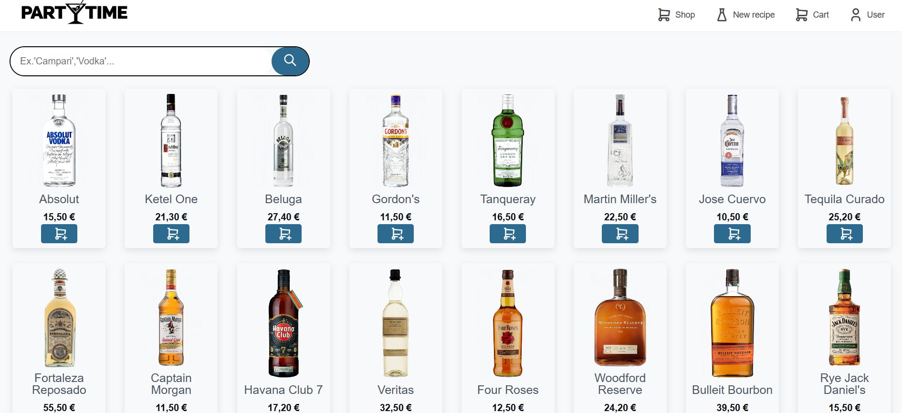

# PARTYTIME

> More than a liquor store — an interactive experience that guides you through the world of spirits, helps you craft unforgettable cocktails, and makes every visit feel like a night out.

## ✨ What is this?

is a full-stack web application that blends e-commerce with entertainment. Users don't just browse and buy — they explore spirits, discover cocktail recipes, and get guided through the art of mixology, all while the store sells more product in the most enjoyable way possible.

---

## 🛠️ Tech Stack

| Layer      | Technology                           |
|------------|--------------------------------------|
| Frontend   | Lit Web Components, HTML, CSS        |
| Build Tool | Vite                                 |
| Backend    | Node.js, Express                     |
| Database   | MongoDB                              |

---

## 📄 License

MIT — do whatever you want, just pour yourself a drink first.
